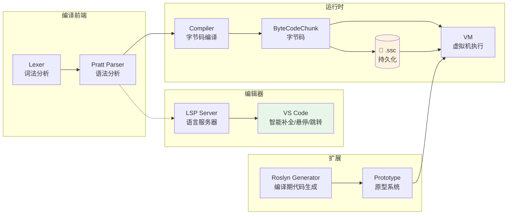

<p align="center">
  <h1 align="center">🌤️ SereinScript</h1>
  <p align="center">
    <strong>表达式驱动的 .NET 动态脚本语言</strong>
    <br/>
    轻量 · 可嵌入 · 全异步 · IDE 原生支持
  </p>
</p>

<p align="center">
  
  
  
  
  
</p>

---

## 📖 项目介绍

**SereinScript**（前身为 SereinDSL）是一门基于 .NET CLR 平台的**表达式驱动**动态脚本语言。JavaScript 风格语法，原生支持闭包、模式匹配、异步调用与 CLR 互操作，旨在为 .NET 应用提供零摩擦的脚本扩展能力。

### 核心理念

> **一切皆为表达式** — `if`、`for`、`when` 不是语句，而是会求值的表达式。这意味着你可以写：
> ```javascript
> let grade = if score >= 90 then "A" else "B"
> ```

### 为什么选择 SereinScript？

| 特性 | 说明 |
|------|------|
| 🚀 **轻量嵌入** | 纯 .NET 实现，无原生依赖，直接引用 DLL 即可 |
| 🔄 **全异步** | 原生 `async/await`，CLR 的 `Task<T>` 调用无缝转为脚本异步 |
| 🧩 **CLR 互操作** | 零配置访问 .NET 对象属性与方法，脚本与宿主双向通行 |
| ⚡ **字节码编译** | AST → 字节码 → 持久化（`.ssc`），预编译方案适合生产环境 |
| 🔧 **编译期扩展** | Roslyn 源码生成器自动生成原型绑定，零反射开销 |
| 🛠️ **IDE 原生支持** | 内置 LSP 服务器 + VS Code 扩展，智能补全、悬停、跳转定义 |

### 适用场景

- 🎮 **游戏脚本系统** — 轻量高性能，适合嵌入游戏引擎驱动逻辑
- 🔌 **插件与扩展平台** — 允许用户通过脚本自定义应用行为
- ⚙️ **自动化运维** — 脚本化编排流程，结合 CLR 能力调用系统 API
- 📚 **教学与学习** — 编译器前端 + 字节码 VM 的完整 C# 参考实现

### 代码速览

```javascript
// Lambda 函数
let factorial = (n) => {
    if n <= 1 then 1
    else n * factorial(n - 1)
}
print("5! = " + factorial(5))

// 对象与数组
let user = {
    name = "Alice",
    skills = ["C#", "JavaScript", "Python"]
}
for skill in user.skills {
    print(skill)
}

// 模式匹配
let score = 85
when score {
    90 => print("A"),
    80 => print("B"),
    _  => print("其他")
}

// 模块导入
import { add, mul } from "math.script"
```

---

## 🏗️ 项目架构

SereinScript 采用经典的编译前端 + 字节码虚拟机 + 编辑器支持分层架构：



### 项目组成

| 项目 | 层级 | 说明 |
|------|------|------|
| **ScriptLang** | 核心库 | Lexer（词法）→ Parser（Pratt 语法）→ Compiler（字节码编译）→ VM（虚拟机执行）→ Prototype（原型系统） |
| **ScriptLang.Generator** | 编译器插件 | Roslyn Incremental Source Generator，编译期生成原型绑定代码，避免反射 |
| **ScriptLang.Lsp** | 编辑器支持 | LSP 语言服务器，提供补全、悬停、跳转定义、查找引用、文档符号等智能功能 |
| **ScriptLang.Demo** | CLI 工具 | 脚本执行、编译对比、字节码保存/加载、批量编译 |

> 详细的架构分析与模块设计请参见 [项目架构文档](docs/project/architecture.md)

---

## 🚀 如何使用

### 环境要求

- .NET SDK **10.0+**
- Windows / Linux / macOS

### 快速上手

```bash
# 1. 克隆仓库
git clone https://github.com/yourusername/SereinScript.git
cd SereinScript/SereinScript

# 2. 构建
dotnet build

# 3. 运行第一个脚本
cd ScriptLang.Demo/bin/Debug/net10.0/
./ScriptLang.Demo ./Samples/1/1.1-基础运算.script
```

### 在 .NET 项目中嵌入

```csharp
using ScriptLang;

var engine = new ScriptEngine();

// 执行脚本文件
var task = engine.CreateTask("./script.script");
var result = await task.RunAsync();

// 执行代码字符串
var task2 = engine.CreateTask("let a = 10; let b = 20; a + b", "<memory>");
var result2 = await task2.RunAsync();
```

### 命令行工具

```bash
ScriptLang.Demo <script>                    # 直接执行
ScriptLang.Demo --save <script>             # 编译为 .ssc 字节码
ScriptLang.Demo --load <file.ssc>           # 加载字节码执行
ScriptLang.Demo --build <script>            # 递归编译（含 import）
ScriptLang.Demo --compare <script>          # 验证编译正确性
```

### VS Code 扩展

1. 进入 `ScriptLang.Lsp/lsp/`，运行 `npm install && npx vsce package`
2. 安装生成的 `.vsix` 文件
3. 在设置中配置 LSP 服务器路径

支持功能：
- ✅ 代码补全（变量、关键字、代码片段、成员访问 `.`）
- ✅ 悬停提示（显示符号类型与定义信息）
- ✅ 跳转定义（F12）
- ✅ 查找引用（Shift+F12）
- ✅ 文档大纲（Ctrl+Shift+O）

> 完整使用指南请参见 [如何使用](docs/project/getting-started.md) | 完整语法参考请参见 [语言参考手册](docs/project/SereinScript-Language-Reference.md)

---

## 🔧 如何二次开发

SereinScript 采用模块化分层设计，各层独立、接口清晰，便于扩展。

### 开发环境

```bash
dotnet build        # 构建全部项目
dotnet test         # 运行测试（如有）
```

推荐使用 Visual Studio 2022 / JetBrains Rider / VS Code 打开 `SereinScript.sln`。

### 常见扩展场景

| 你想做什么 | 入口 |
|-----------|------|
| 添加新的语法结构（如 `++` 运算符） | Lexer → Parser → AST → Compiler → VM |
| 添加新的内置函数（如 `random()`） | `BuiltinCache.cs` + LSP `SymbolTable` |
| 添加新的系统模块（如 `math`） | `ScriptLang/System/` + 全局作用域注册 |
| 为值类型扩展原型方法 | 使用 `[PrototypeExtension]` / `[PrototypeFunction]` 属性 |
| 扩展 LSP 功能（如 Rename） | 新建 Handler + 注册到 `Program.cs` |
| 添加新的 AST 节点类型 | `Ast.cs` + 编译器/VM 对应处理 |

> 完整开发指南请参见 [如何二次开发](docs/project/development.md)

---

## 📚 文档目录

```
docs/
├── project/
│   ├── index.md                           # 文档导航首页
│   ├── overview.md                        # 项目介绍
│   ├── architecture.md                    # 项目架构
│   ├── getting-started.md                 # 如何使用
│   ├── development.md                     # 如何二次开发
│   ├── SereinScript-Language-Reference.md # 完整语言参考手册
│   └── system-modules.md                  # 系统模块说明
└── dev/                                   # 开发阶段文档（内部）
    ├── reference/                         # 技术参考
    ├── lsp/                               # LSP 设计
    ├── feature-datetimevalue/             # DateTimeValue 特性
    └── feature-bytecode-persistence/      # 字节码持久化特性
```

---

## 社群
QQ群 955830545
提供技术交流与支持，欢迎加入。
因为个人是社畜，所以可能不会及时回复，请谅解。

---

## 📄 许可证

本项目基于 MIT 许可证开源。

---

<p align="center">
  <sub>Made with ❤️ by developers who believe scripting should be simple and powerful.</sub>
</p>
