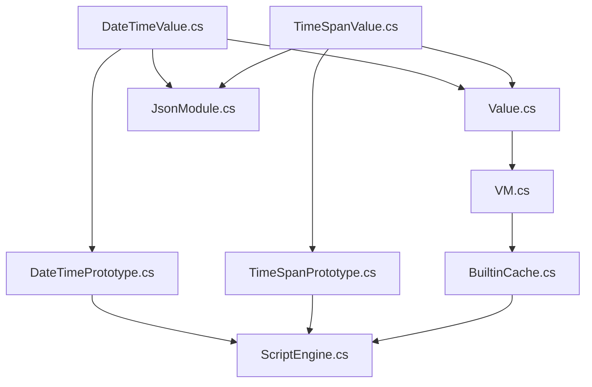

# DateTimeValue 任务拆分

## 依赖图

## 任务列表

| ID | 任务 | 文件 | 依赖 | 验收 |
|----|------|------|------|------|
| T1 | 新增 DateTimeValue 类 | `Runtime/DateTimeValue.cs` | 无 | 编译通过 |
| T2 | 新增 TimeSpanValue 类 | `Runtime/TimeSpanValue.cs` | 无 | 编译通过 |
| T3 | Value 基类增加 IsDateTime/IsTimeSpan + ToString | `Runtime/Value.cs` | T1, T2 | 编译通过 |
| T4 | VM 操作符与转换路径 | `Runtime/ByteCode/VM.cs` | T1, T2, T3 | 编译通过 |
| T5 | 内置函数 now/date/timespan + typeof | `BuiltinCache.cs` | T1, T2 | 编译通过 |
| T6 | DateTimePrototype | `Prototype/DateTimePrototype.cs` | T1 | 编译通过 |
| T7 | TimeSpanPrototype | `Prototype/TimeSpanPrototype.cs` | T2 | 编译通过 |
| T8 | JSON 模块 ConvertToClrObject | `System/JsonModule.cs` | T1, T2 | 编译通过 |
| T9 | ScriptEngine 注册 Prototype | `ScriptEngine.cs` | T6, T7 | 编译通过 |
| T10 | 编译验证 + 回归 | 全部 | T1-T9 | `dotnet build` 通过 |
