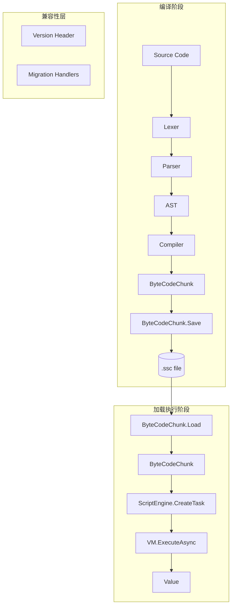

# 架构设计：字节码持久化

## 1. 架构概览



## 2. 二进制文件格式（.ssc）

### 2.1 整体结构

```
┌──────────────────────────────────────────────────┐
│                  File Header                       │
│  Magic (4B)  │ Version (4B) │ Flags (4B)         │
├──────────────────────────────────────────────────┤
│              VariableTable Section                 │
│  Counts (16B) │ ParamSlots │ Names │ Dictionaries │
├──────────────────────────────────────────────────┤
│               Constants Section                   │
│  Count (4B) │ [Type(1B) + Data] × N              │
├──────────────────────────────────────────────────┤
│                 Code Section                      │
│  Count (4B) │ [OpCode(1B) + Operand] × N         │
├──────────────────────────────────────────────────┤
│               Closures Section                    │
│  Count (4B) │ [Nested Chunk] × N                 │
└──────────────────────────────────────────────────┘
```

### 2.2 头部 (12 bytes)

| 偏移 | 大小 | 字段 | 值 |
|------|------|------|-----|
| 0 | 4 | Magic | `0x53 0x53 0x43 0x00` ("SSC\0") |
| 4 | 4 | Version | `1` (主版本) |
| 8 | 4 | Flags | 保留 |

### 2.3 类型标记

```csharp
enum SerializedType : byte
{
    Null      = 0x00,
    Int32     = 0x01,
    Int64     = 0x02,
    Float     = 0x03,
    Double    = 0x04,
    Decimal   = 0x05,
    String    = 0x10,
    List      = 0x20,  // List<object?> for Import data
}

enum OperandType : byte
{
    None      = 0x00,
    Int32     = 0x01,
    Closure   = 0x02,  // (int, List<string>, List<(string, int)>)
}
```

### 2.4 VariableTable 编码

```
LocalCount   : int32 (4B)
CaptureCount : int32 (4B)
GlobalCount  : int32 (4B)
BuiltinCount : int32 (4B)

// ParamSlots (Dictionary<string,int>)
ParamSlotCount: int32 (4B)
For each:
    Name length: int32
    Name: UTF-8 bytes
    Slot: int32

// GlobalNames (string[])
GlobalNameCount: int32 (4B)
For each:
    Name length: int32
    Name: UTF-8 bytes

// BuiltinNames (string[])
BuiltinNameCount: int32 (4B)
For each:
    Name length: int32
    Name: UTF-8 bytes

// LocalNames (Dictionary<string,int>)
LocalNameCount: int32 (4B)
For each:
    Name length: int32
    Name: UTF-8 bytes
    Slot: int32

// CaptureNames (Dictionary<string,int>)
CaptureNameCount: int32 (4B)
For each:
    Name length: int32
    Name: UTF-8 bytes
    Slot: int32
```

### 2.5 Constants 编码

只序列化动态常量（`_constants` 列表），紧凑编码的 null/bool/int 由加载端自动重建。

```
ConstantCount: int32 (4B)
For each:
    Type: SerializedType (1B)
    If String:
        Length: int32
        UTF-8 bytes
    If Int64: 8 bytes
    If Float: 4 bytes
    If Double: 8 bytes
    If Decimal: 16 bytes
    If List:
        ElementCount: int32
        For each element:
            Type + Data (递归)
```

### 2.6 Code (指令) 编码

```
InstructionCount: int32 (4B)
For each:
    OpCode: byte (1B)
    OperandType: OperandType (1B)
    If Int32:
        Value: int32 (4B)
    If Closure:
        ChunkIndex: int32 (4B)
        ParamCount: int32 (4B)
        For each param:
            Name length: int32
            Name: UTF-8 bytes
        CaptureCount: int32 (4B)
        For each capture:
            Name length: int32
            Name: UTF-8 bytes
            OuterSlot: int32 (4B)
    If None:
        (nothing)
```

### 2.7 Closures 编码

```
ClosureCount: int32 (4B)
For each:
    递归写入完整的 Chunk 结构
    (VariableTable + Constants + Code + Closures)
```

## 3. 类型设计

### 3.1 ByteCodeChunkWriter（序列化器）

```csharp
namespace ScriptLang.Runtime.ByteCode;

/// <summary>
/// 将 ByteCodeChunk 序列化为二进制流
/// </summary>
internal sealed class ByteCodeChunkWriter(BinaryWriter writer)
{
    public void Write(ByteCodeChunk chunk);

    private void WriteVariableTable(VariableTable vt);
    private void WriteConstants(ByteCodeChunk chunk);
    private void WriteCode(ByteCodeChunk chunk);
    private void WriteClosures(ByteCodeChunk chunk);
    private void WriteOperand(object? operand);
    private void WriteString(string s);
}
```

### 3.2 ByteCodeChunkReader（反序列化器）

```csharp
namespace ScriptLang.Runtime.ByteCode;

/// <summary>
/// 从二进制流反序列化为 ByteCodeChunk
/// </summary>
internal sealed class ByteCodeChunkReader(BinaryReader reader)
{
    public ByteCodeChunk Read();

    private VariableTable ReadVariableTable();
    private List<object?> ReadConstants();
    private List<Instruction> ReadCode();
    private List<ByteCodeChunk> ReadClosures();
    private object? ReadOperand(OperandType type);
    private string ReadString();
}
```

### 3.3 ByteCodeChunk 新增公开 API

```csharp
public sealed class ByteCodeChunk
{
    // 现有成员 ...

    /// <summary>序列化到文件</summary>
    public static void Save(ByteCodeChunk chunk, string path);

    /// <summary>序列化到流</summary>
    public static void Save(ByteCodeChunk chunk, Stream stream);

    /// <summary>从文件反序列化</summary>
    public static ByteCodeChunk Load(string path);

    /// <summary>从流反序列化</summary>
    public static ByteCodeChunk Load(Stream stream);
}
```

### 3.4 ScriptEngine 新增重载

```csharp
public sealed class ScriptEngine
{
    // 新增：从已加载的 ByteCodeChunk 创建任务
    public ScriptTask CreateTask(ByteCodeChunk chunk);
}
```

## 4. 数据流

### 4.1 序列化流程

```
ByteCodeChunk.Save(chunk, path)
    ├── File.Create(path) → FileStream
    ├── BinaryWriter(stream)
    ├── ByteCodeChunkWriter.Write(chunk)
    │   ├── Write Magic "SSC\0"
    │   ├── Write Version = 1
    │   ├── Write Flags = 0
    │   ├── WriteVariableTable(chunk.VariableTable)
    │   ├── WriteConstants(chunk.Constants)
    │   ├── WriteCode(chunk.Code)
    │   └── WriteClosures(chunk.Closures) [递归]
    └── stream.Close()
```

### 4.2 反序列化流程

```
ByteCodeChunk.Load(path)
    ├── File.OpenRead(path) → FileStream
    ├── BinaryReader(stream)
    ├── ByteCodeChunkReader.Read()
    │   ├── Read + Validate Magic
    │   ├── Read Version → 版本检查
    │   ├── Read Flags
    │   ├── ReadVariableTable() → VariableTable
    │   ├── ReadConstants() → List<object?>
    │   ├── ReadCode() → List<Instruction>
    │   ├── ReadClosures() → List<ByteCodeChunk> [递归]
    │   └── new ByteCodeChunk(code, constants, closures, vt)
    │       └── 内部重建 _constantMap
    └── stream.Close()
```

### 4.3 运行时关联流程

```
ScriptEngine.CreateTask(chunk)
    ├── 提取 chunk.VariableTable
    ├── 遍历 GlobalNames →
    │   GlobalSlotRegistry.Register(name) // 重新注册全局变量槽位
    ├── GlobalSlotRegistry.InitializeValues()
    ├── 创建 ScriptTask（VM.ExecuteAsync(chunk)）
    └── VM.InitFrameSlots → 自动从 GlobalSlotRegistry 读取值
```

## 5. 跨版本兼容方案

### 5.1 版本号语义

| 版本 | 格式 | 兼容策略 |
|------|------|----------|
| 1 | 初始版本 | — |

### 5.2 前向兼容（新版本读旧文件）

版本号存在 Header 中。读取时若 Version < CurrentVersion，应用迁移：
- 缺失字段使用默认值
- 不抛出异常

### 5.3 后向兼容（旧版本读新文件）

若 Version > CurrentVersion，可以选择：
- **严格模式**：抛出 NotSupportedException
- **宽松模式**：跳过未知字段（依赖长度前缀或段标记）

当前实现采用**严格模式**，版本号必须完全匹配。

### 5.4 扩展预留

- **Flags 字段**：可用于指示可选段的存在（如压缩、加密）
- **段格式**：每段以长度前缀开头，允许未知段被跳过
- **类型标记扩展**：`SerializedType` 和 `OperandType` 使用 byte 枚举，最多 256 种类型

## 6. 错误处理

| 错误场景 | 行为 |
|----------|------|
| Magic 不匹配 | `InvalidDataException("不是有效的 .ssc 文件")` |
| 版本不匹配 | `NotSupportedException($"不支持的 .ssc 版本: {version}")` |
| 文件损坏/截断 | `EndOfStreamException` (BinaryReader 原生) |
| 未知 OperandType | `InvalidDataException($"未知的操作数类型: {type}")` |
| 未知 SerializedType | `InvalidDataException($"未知的常量类型: {type}")` |

## 7. 性能考量

| 指标 | 目标 | 策略 |
|------|------|------|
| 文件大小 | < 2× 源码大小 | 紧凑编码，int 用 varint 可选 |
| 保存速度 | < 10ms (千行脚本) | 单次 BinaryWriter 写入，无中间缓冲 |
| 加载速度 | < 10ms (千行脚本) | 单次 BinaryReader 读取，直接组装对象 |
| 内存 | ~2× Chunk 大小 | 避免不必要的数组拷贝 |

---

> 创建时间: 2026-06-06 | 状态: 待确认
