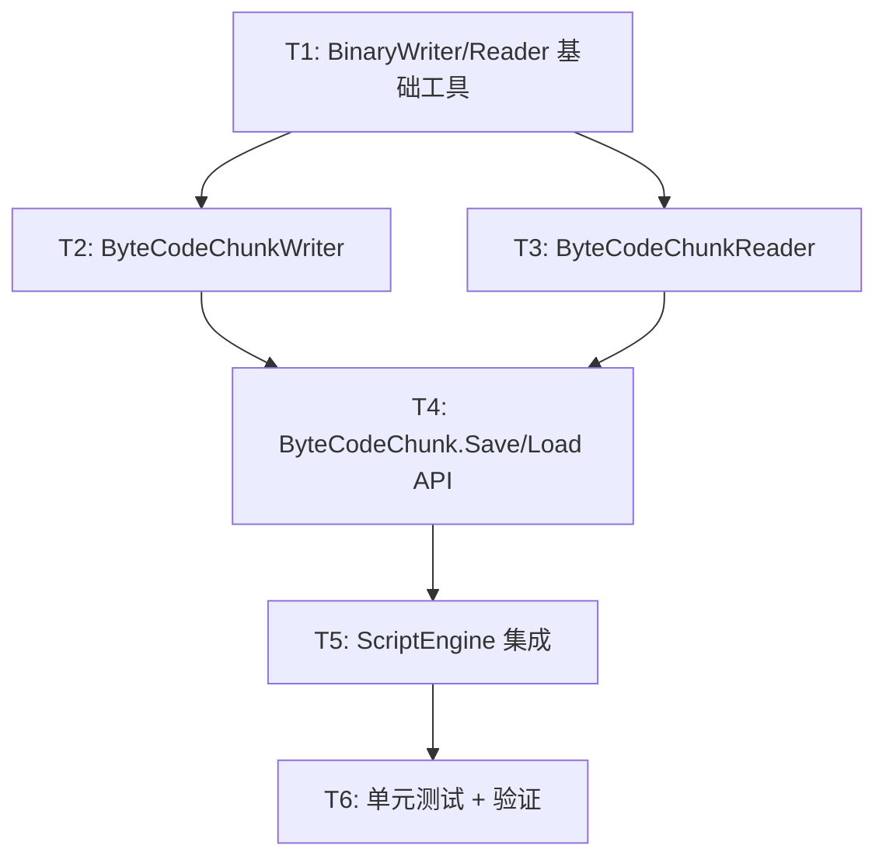

# 任务拆分：字节码持久化

## 依赖关系图

## 任务列表

### T1: 序列化基础工具类

**输入**：无
**输出**：`SerializedType` 和 `OperandType` 枚举 + `BinaryWriter`/`BinaryReader` 扩展方法
**实现约束**：
- 使用 BinaryWriter/Reader 原生方法，不引入第三方库
- 字符串编码用 UTF-8（长度前缀 + 字节数组）
- 所有多字节整数用 Little Endian（.NET 默认）

**验收标准**：
- WriteString / ReadString 往返测试通过
- 支持 null 字符串写入/读取

**依赖**：无

---

### T2: ByteCodeChunkWriter（序列化器）

**输入**：`ByteCodeChunk`
**输出**：`ByteCodeChunkWriter` 类，能将 Chunk 写入 BinaryWriter

**实现约束**：
- 处理 VariableTable null 的情况
- 处理 Operand 的三种类型：null, int, CreateClosure 元组
- 递归处理嵌套闭包
- 只序列化动态常量（`_constants`），紧凑编码常量由加载端重建

**验收标准**：
- 空 Chunk 序列化不抛异常
- 含闭包的 Chunk 递归序列化正确
- CreateClosure 元组操作数正确写入

**依赖**：T1

---

### T3: ByteCodeChunkReader（反序列化器）

**输入**：BinaryReader
**输出**：`ByteCodeChunkReader` 类，能从 BinaryReader 重建 Chunk

**实现约束**：
- 校验 Magic number
- 校验版本号
- 使用已有的 internal constructor 组装 Chunk
- 重建 `_constantMap` 去重索引（由构造函数已实现）

**验收标准**：
- 空 Chunk 反序列化正确
- Magic 不匹配抛 InvalidDataException
- 版本不匹配抛 NotSupportedException
- 反序列化后的 Chunk 能正确执行

**依赖**：T1, T2（用于生成测试数据）

---

### T4: ByteCodeChunk.Save/Load 公开 API

**输入**：Chunk + 文件路径 / Stream
**输出**：`ByteCodeChunk` 上的 4 个公开静态方法

**实现约束**：
- `Save(ByteCodeChunk chunk, string path)` — 文件保存
- `Save(ByteCodeChunk chunk, Stream stream)` — 流保存
- `Load(string path)` — 文件加载
- `Load(Stream stream)` — 流加载
- File I/O 使用 `File.Create` / `File.OpenRead`

**验收标准**：
- Save → Load 往返后的 Chunk 与原始 Chunk 结构等价
- Code 指令数量、操作码、操作数一致
- 常量表一致
- VariableTable 一致
- 闭包嵌套结构一致

**依赖**：T2, T3

---

### T5: ScriptEngine 集成

**输入**：`ByteCodeChunk`
**输出**：`ScriptEngine.CreateTask(ByteCodeChunk chunk)` 方法

**实现约束**：
- 提取 VariableTable 的 GlobalNames → 重新注册到 GlobalSlotRegistry
- 初始化 GlobalSlotRegistry 运行时值数组
- 复用现有的 `ScriptTask` 工厂模式

**验收标准**：
- 从文件加载 Chunk 后 CreateTask → RunAsync 返回正确结果
- 编译执行结果 == 加载执行结果

**依赖**：T4

---

### T6: 测试验证

**输入**：现有 Demo 脚本
**输出**：单元测试 + Demo 验证

**实现约束**：
- 选取几个典型 Demo 脚本（基础运算、闭包、递归等）
- 编译 → 保存 → 加载 → 执行
- 对比直接编译执行和加载执行的结果

**验收标准**：
- 所有测试脚本的两种执行方式输出一致
- 文件大小合理（< 2× 源码大小）

**依赖**：T5

---

> 创建时间: 2026-06-06
