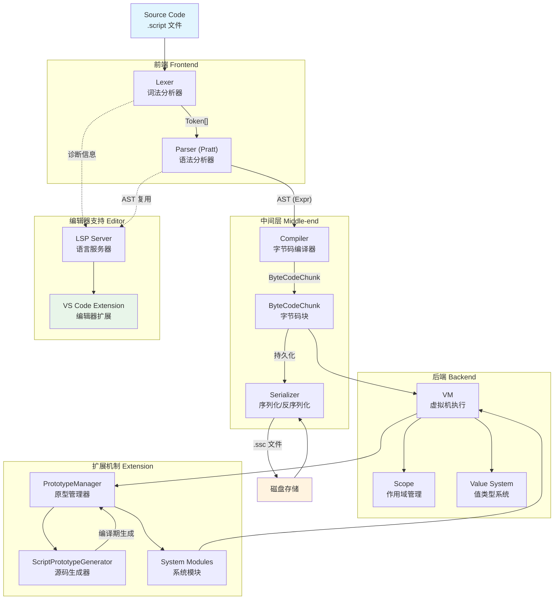
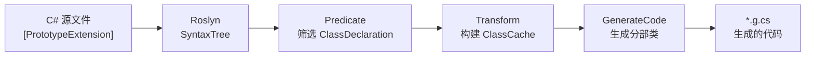
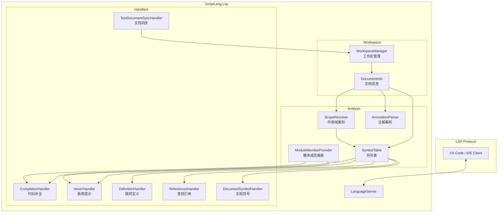

# 项目架构

## 整体架构概览

SereinScript 采用经典的解释型语言架构，并在此基础上增加了字节码编译层和 LSP 编辑器支持。



## 模块详解

### 1. ScriptLang — 核心库

核心库是整个项目的基石，包含了从源码到执行结果的完整管道。

#### 1.1 词法分析器（Lexer）

文件: [ScriptLang/Lexer/](https://github.com/yourusername/SereinScript/tree/master/ScriptLang/Lexer)

- **职责**: 将源代码文本扫描为 Token 序列
- **支持元素**:
  - 关键字: `let`, `var`, `if`, `then`, `else`, `when`, `for`, `in`, `return`, `import`, `from`, `true`, `false`, `null`
  - 运算符: 算术 (`+`, `-`, `*`, `/`, `%`)、比较 (`==`, `!=`, `<`, `>`, `<=`, `>=`)、逻辑 (`&&`, `||`, `!`)
  - 分隔符: `{`, `}`, `(`, `)`, `[`, `]`, `,`, `.`, `;`, `=>`
  - 字面量: 整数、浮点数、字符串（双引号）、布尔、null
- **辅助函数**: `isAlpha`, `isDigit`, `isAlphaNumeric` 定义脚本合法字符

详细设计见 [dev-lexer.md](../dev-lexer.md)

#### 1.2 语法分析器（Parser）

文件: [ScriptLang/Parser/](https://github.com/yourusername/SereinScript/tree/master/ScriptLang/Parser)

- **职责**: 将 Token 序列解析为抽象语法树（AST）
- **解析算法**: Pratt Parser（自顶向下运算符优先级解析）
- **核心文件**:
  - `Parser.cs` — 主解析逻辑
  - `PrattPrecedence.cs` — 优先级定义
  - `Ast.cs` — AST 节点类型定义

关键 AST 节点类型:

| 节点类型 | 说明 |
|---------|------|
| `ProgramExpr` | 程序根节点 |
| `BlockExpr` | 代码块 |
| `LetExpr` / `VarExpr` | 变量声明 |
| `AssignExpr` | 变量赋值 |
| `BinaryExpr` | 二元运算 |
| `UnaryExpr` | 一元运算 |
| `LambdaExpr` | Lambda 函数 |
| `CallExpr` | 函数调用 |
| `IfExpr` | if-then-else 表达式 |
| `WhenExpr` | when 模式匹配 |
| `ForExpr` | for-in 循环 |
| `ImportStmt` | import 导入 |
| `MemberAccessExpr` | 成员访问 `.` |
| `IndexAccessExpr` | 索引访问 `[]` |
| `ConditionalExpr` | 三元条件 |
| `LiteralExpr` | 字面量 |
| `ReturnExpr` | return 返回 |

详细设计见 [dev-parser.md](../dev-parser.md)

#### 1.3 运行时（Runtime）

##### 值类型系统

文件: [ScriptLang/Runtime/Value.cs](https://github.com/yourusername/SereinScript/tree/master/ScriptLang/Runtime/Value.cs)

所有脚本值继承自抽象基类 `Value`：

```
Value (abstract)
├── NullValue         # null
├── BoolValue         # bool
├── NumberValue<T>    # int/long/float/double/decimal
├── StringValue       # string
├── ArrayValue        # 数组
├── ObjectValue       # 对象（字典）
├── FunctionValue     # 脚本函数（Lambda）
├── CompiledFunctionValue  # 编译后的函数
├── ClrObjectValue    # CLR 对象包装
└── ClrMethodValue    # CLR 方法包装
```

##### 作用域

文件: [ScriptLang/Runtime/Scope.cs](https://github.com/yourusername/SereinScript/tree/master/ScriptLang/Runtime/Scope.cs)

- 全局作用域: 存储内置函数和系统模块
- 局部作用域: 函数和代码块内创建的变量
- 支持变量定义（`Define`/`DefineConst`）、查找（`Lookup`）、赋值（`Assign`）
- 闭包捕获: 自由变量自动捕获到闭包作用域

##### 字节码虚拟机

SereinScript 采用**编译-执行**两阶段架构：

1. **编译阶段**: AST → `ByteCodeChunk`
   - 文件: [ScriptLang/Runtime/ByteCode/Compiler.cs](https://github.com/yourusername/SereinScript/tree/master/ScriptLang/Runtime/ByteCode/Compiler.cs)
   - 负责将 AST 编译为线性字节码指令序列
   - 同时构建变量表（`VariableTable`）

2. **执行阶段**: `ByteCodeChunk` → `VM` 执行
   - 文件: [ScriptLang/Runtime/ByteCode/VM.cs](https://github.com/yourusername/SereinScript/tree/master/ScriptLang/Runtime/ByteCode/VM.cs)
   - 基于栈的虚拟机
   - 支持指令: `LoadConst`, `LoadGlobal`, `StoreGlobal`, `Call`, `Jump`, `Return` 等
   - 调用帧管理（`CallFrame`）

3. **持久化**: `ByteCodeChunk` ↔ `.ssc` 文件
   - 文件: [ScriptLang/Runtime/ByteCode/ByteCodeChunkSerializer.cs](https://github.com/yourusername/SereinScript/tree/master/ScriptLang/Runtime/ByteCode/ByteCodeChunkSerializer.cs)
   - 支持将编译好的字节码保存为 `.ssc` 文件，下次直接加载执行

##### 原型系统

文件: [ScriptLang/Prototype/](https://github.com/yourusername/SereinScript/tree/master/ScriptLang/Prototype)

原型系统为脚本的值类型扩展方法。例如，`StringValue` 的原型提供了 `.length`、`.split()`、`.substring()` 等成员。

- `IPrototype` — 原型接口
- `PrototypeManager` — 原型注册与分发
- `ArrayPrototype` — 数组原型方法（map, filter, forEach, push, pop, slice, find, findIndex, reverse）
- `ObjectPrototype` — 对象原型方法（keys, values, has）
- `StringPrototype` — 字符串原型方法（split, substring, toUpperCase, toLowerCase, trim, contains, startsWith, endsWith）

##### 系统模块

文件: [ScriptLang/System/](https://github.com/yourusername/SereinScript/tree/master/ScriptLang/System)

为脚本提供 CLR/系统功能的访问入口：

| 模块 | 功能 |
|------|------|
| `ConsoleModule` | 控制台 I/O |
| `FileModule` | 文件系统操作 |
| `PathModule` | 路径处理 |
| `JsonModule` | JSON 序列化/反序列化 |
| `NetworkModule` | HTTP 网络请求 |
| `TimerModule` | 定时器功能 |
| `CryptoModule` | 加密/哈希 |
| `ProcessModule` | 进程管理 |

#### 1.4 脚本引擎

文件: [ScriptLang/ScriptEngine.cs](https://github.com/yourusername/SereinScript/tree/master/ScriptLang/ScriptEngine.cs)

`ScriptEngine` 是脚本执行的入口点，管理：

- `PrototypeManager` — 原型注册
- `ImportResolver` — 模块导入
- `SourceManager` — 源文件管理
- `GlobalScope` — 全局作用域
- 编译缓存 — AST → ByteCodeChunk 缓存

---

### 2. ScriptLang.Generator — 源码生成器

文件: [ScriptLang.Generator/](https://github.com/yourusername/SereinScript/tree/master/ScriptLang.Generator)

这是一个 **Roslyn Incremental Source Generator**，在编译期自动生成原型扩展代码，避免运行时的反射开销。

#### 工作原理



#### 关键组件

- `ScriptPrototypeGenerator` — 生成器入口，实现 `IIncrementalGenerator`
- `ClassCache` / `MemberCache` / `AttrCache` — 编译期缓存模型
- `ScriptPrototypeExtension` — 代码生成逻辑
  - `GenerateProperty()` — 生成原型属性绑定
  - `GenerateMethod()` — 生成原型方法绑定，包括参数校验、类型转换、异步适配
- `PrototypeExtensionAttribute` — 标记需要生成原型的类
- `PrototypeFunctionAttribute` / `PrototypePropertyAttribute` — 标记具体的方法/属性

#### 生成代码示例

给定输入:
```csharp
[PrototypeExtension(PushThis = true)]
public partial class StringPrototype
{
    [PrototypeProperty]
    public static int GetLength(StringValue target) => target.Value.Length;
}
```

生成器会自动生成实现 `IPrototype` 接口的分部类，包括：
- 原型方法字典注册
- `IsTarget()` 类型判定
- 参数校验与类型转换
- 异步方法适配

---

### 3. ScriptLang.Lsp — LSP 语言服务器

文件: [ScriptLang.Lsp/](https://github.com/yourusername/SereinScript/tree/master/ScriptLang.Lsp)

基于 [OmniSharp.Extensions.LanguageServer](https://github.com/OmniSharp/omnisharp-roslyn) 实现的 LSP 服务器，为 `.script` 文件提供智能编辑支持。

#### 架构



#### LSP 功能

| 功能 | Handler | 说明 |
|------|---------|------|
| **代码补全** | CompletionHandler | 变量、关键字、代码片段、成员访问（`.` 触发）、import 补全 |
| **悬停提示** | HoverHandler | 显示符号类型（let/var/function/builtin）、声明位置、字面量类型 |
| **跳转定义** | DefinitionHandler | 标识符引用 → 声明位置 |
| **查找引用** | ReferencesHandler | 给定符号的所有引用位置 |
| **文档符号** | DocumentSymbolHandler | 文档大纲（变量、函数、import 层级） |
| **文档同步** | TextDocumentSyncHandler | didOpen/didChange/didClose/didSave 事件处理 |

#### 语义分析能力

- **作用域解析** (`ScopeResolver`): 复用核心库的 Parser 生成 AST，构建带层级的作用域树
- **符号表** (`SymbolTable`): 基于 AST 构建全文档符号索引，支持可见性查询
- **模块成员推断** (`ModuleMemberProvider`): 从 import 的目标文件中静态分析导出成员，支持跨文件补全
- **注解解析** (`AnnotationParser`): 解析 `@type` 等注解，辅助类型推断

> 注意: LSP 服务器本身复用了 ScriptLang 核心库的 Lexer 和 Parser 进行 AST 构建，确保了编辑器中的分析与实际运行时完全一致。

详细设计见 [lsp/DESIGN_lsp.md](../lsp/DESIGN_lsp.md)

---

### 4. ScriptLang.Demo — 命令行演示

文件: [ScriptLang.Demo/Program.cs](https://github.com/yourusername/SereinScript/tree/master/ScriptLang.Demo/Program.cs)

命令行工具，展示 ScriptLang 的完整使用方式。

#### 运行模式

| 命令 | 说明 |
|------|------|
| `ScriptLang.Demo <script-path>` | 直接编译并执行脚本 |
| `ScriptLang.Demo --compare <script-path>` | 对比「直接执行」vs「编译→保存→加载→执行」结果 |
| `ScriptLang.Demo --save <script-path>` | 编译并保存为 `.ssc` 字节码文件 |
| `ScriptLang.Demo --load <ssc-path>` | 加载 `.ssc` 文件并执行 |
| `ScriptLang.Demo --build <script-path>` | 递归编译脚本及其所有 import 依赖 |

#### 示例脚本

项目 `Samples/` 目录包含 5 组示例：

| 目录 | 主题 | 示例 |
|------|------|------|
| `Samples/1/` | 基础语法 | 运算、变量、字符串、函数、对象、数组、数值类型 |
| `Samples/2/` | 控制流 | 逻辑运算、条件表达式、循环、模式匹配、错误处理 |
| `Samples/3/` | 函数式 | 闭包、高阶函数、递归、快速排序、矩阵运算 |
| `Samples/4/` | CLR 互操作 | CLR 对象、异步调用、CLR 回调 |
| `Samples/高级/` | 高级用例 | LINQ 链式操作、Pinia 风格状态管理 |

---

## 数据流全景

```mermaid
sequenceDiagram
    participant SRC as .script 源码
    participant LEX as Lexer
    participant PAR as Parser
    participant CMP as Compiler
    participant BC as ByteCodeChunk
    participant VM as VM
    participant VAL as Value/Result

    SRC->>LEX: 读入源码文本
    LEX->>PAR: Token[]
    PAR->>CMP: AST (Expr)
    CMP->>BC: ByteCodeChunk
    BC->>VM: 执行指令序列
    VM->>VAL: 返回值
    
    Note over CMP,BC: 可选：序列化到 .ssc 文件
    Note over BC,VM: 可选：从 .ssc 文件反序列化加载
```
